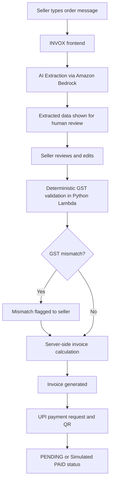
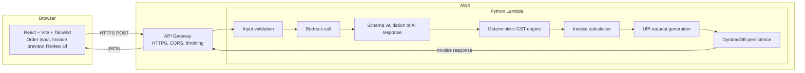
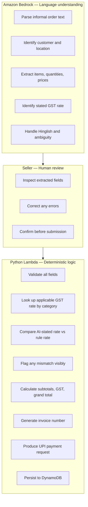
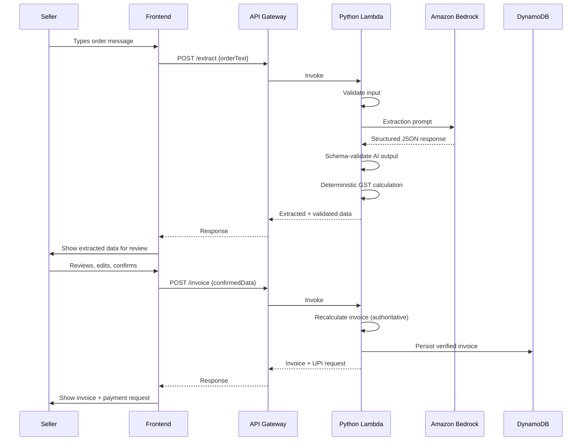

# INVOX

**AI-assisted invoicing from messy business messages.**

> **AI proposes. Rules decide. You stay in control.**

INVOX converts unstructured English/Hinglish business order messages into structured, reviewable invoices. A seller types an order the way they would send a WhatsApp message. INVOX passes it through Amazon Bedrock for natural-language extraction, presents the result for human review and editing, applies a deterministic GST engine for authoritative financial calculation, generates the invoice, and produces a UPI payment request.

The AI never owns the numbers. Every financial result is calculated by deterministic backend logic after the seller has reviewed and confirmed what the AI extracted.

---

## The Problem

Small business invoicing in India is messy. Sellers communicate orders in informal English and Hinglish, mixing item names, quantities, prices, and GST references in any order. Turning that into a compliant invoice requires either manual data entry or expensive ERP software — neither works well for a seller typing on a phone.

---

## The Solution

INVOX treats the order message as the input, not a form. The seller describes the order naturally. Bedrock interprets it. The seller reviews the extracted data, corrects anything the AI got wrong, and the backend handles the rest: GST validation, invoice calculation, and payment request generation.

---

## Core Workflow



---

## Key Principles

| Principle | Description |
|-----------|-------------|
| AI proposes, rules decide | Bedrock extracts. A deterministic engine calculates. |
| Human in the loop | The seller reviews and approves before any invoice is issued. |
| Server-side authority | Financial totals are calculated on the backend, never trusted from the client or AI. |
| GST transparency | Mismatches between AI-stated and rule-validated GST are flagged visibly. |
| Demo reliability | A fixture/mock mode keeps the app demoable if external AI infrastructure is unavailable. |
| Minimal scope | No payment gateway, no auth, no CRM. One workflow, done well. |

---

## Architecture



**Note:** The AWS backend (Lambda, API Gateway, Bedrock, DynamoDB) is implemented and tested locally with mocks. No live AWS credentials or live deployment have been performed. The code is structured for deployment via AWS SAM + Antideploy.

---

## AI vs Deterministic Rules



The AI handles language. The seller handles judgment. The rules handle arithmetic. No stage can override another without going through the intended flow.

---

## Final Implementation Status

| Area | Status |
|------|--------|
| React + Vite + Tailwind frontend | Complete |
| Order input (WhatsApp-style) | Complete (M2) |
| AI extraction with mock/fallback | Complete (M3) |
| Human review/edit of extraction | Complete (M4/M5) |
| Deterministic GST engine | Complete (M5/M6) |
| Invoice generation | Complete (M7) |
| UPI payment request / QR | Complete (M8) |
| DynamoDB persistence | Complete (M9) |
| Light/dark theme | Complete (M10) |
| Landing page | Complete (M10) |
| Design system | Complete (M10) |
| Pytest backend tests | 212 passing |
| Production build | Verified |
| AWS backend code | Complete (not live-deployed) |

---

## Technology Stack

| Layer | Technology |
|-------|-----------|
| Frontend | React 18, Vite 5, Tailwind CSS 3 |
| Backend | Python 3.11, AWS Lambda |
| API | Amazon API Gateway |
| AI / NLP | Amazon Bedrock (Claude 3 Haiku/Sonnet) |
| Database | Amazon DynamoDB |
| Infrastructure | AWS SAM |
| Testing | Pytest (backend, 212 tests passing) |
| IDE | Kiro (early phase), OpenCode (later phase) |
| Deployment | Antideploy (manual dashboard) |
| Version control | Git + GitHub |

---

## Project Structure

### Current repository (M1–M10 implemented)

```
invox/
├── src/
│   ├── App.jsx                   # Root layout (two-panel)
│   ├── main.jsx                  # React entry point
│   ├── index.css                 # Tailwind base styles + design system
│   └── components/
│       ├── Header.jsx            # Top navigation
│       ├── OrderComposer.jsx     # Order text input with example
│       ├── ExtractionReview.jsx  # Human review/edit of AI extraction
│       ├── InvoicePreview.jsx    # Invoice display + GST breakdown
│       ├── LoadingState.jsx      # Extraction loading state
│       ├── EmptyState.jsx        # Pre-invoice placeholder
│       └── WorkflowSteps.jsx     # Progress indicator (in App.jsx)
├── backend/
│   ├── src/
│   │   ├── app.py                # Lambda entry point
│   │   ├── handlers/             # API route handlers
│   │   │   ├── extract.py        # POST /extract
│   │   │   ├── gst.py            # POST /gst/calculate
│   │   │   ├── invoice.py        # POST /invoice/generate, GET /invoice/{id}
│   │   │   ├── upi.py            # POST /upi/generate
│   │   │   └── health.py         # GET /health
│   │   ├── models/               # Data models
│   │   │   ├── extraction.py     # Extraction result types
│   │   │   ├── gst.py            # GST calculation types
│   │   │   ├── invoice.py        # Invoice types
│   │   │   ├── persistence.py    # DynamoDB persistence types
│   │   │   ├── request.py        # Request types
│   │   │   ├── response.py       # Response types
│   │   │   └── upi.py            # UPI types
│   │   ├── services/             # Business logic
│   │   │   ├── bedrock_client.py       # Bedrock API client
│   │   │   ├── dynamodb_repository.py  # DynamoDB repository
│   │   │   ├── extraction_prompt.py    # Bedrock prompts
│   │   │   ├── gst_engine.py           # Deterministic GST engine
│   │   │   ├── invoice_service.py      # Invoice generation
│   │   │   ├── persistence_service.py  # Persistence layer
│   │   │   ├── response_parser.py      # Bedrock response parsing
│   │   │   └── upi_service.py          # UPI request generation
│   │   ├── utils/
│   │   │   └── responses.py            # Standardized responses
│   │   └── validators/               # Input validation
│   │       ├── extract.py
│   │       ├── gst.py
│   │   ├── invoice.py
│   │       └── upi.py
│   ├── tests/                        # 212 tests passing
│   │   ├── test_app.py
│   │   ├── test_dynamodb_repository.py
│   │   ├── test_extract.py
│   │   ├── test_gst_engine.py
│   │   ├── test_gst_handler.py
│   │   ├── test_gst_validators.py
│   │   ├── test_health.py
│   │   ├── test_invoice_handler.py
│   │   ├── test_invoice_handler_m9.py
│   │   ├── test_invoice_models.py
│   │   ├── test_invoice_service.py
│   │   ├── test_persistence_models.py
│   │   ├── test_persistence_service.py
│   │   ├── test_responses.py
│   │   ├── test_upi_handler_m9.py
│   │   └── test_validators.py
│   ├── requirements.txt
│   └── requirements-dev.txt
├── template.yaml                     # AWS SAM template (single Lambda + DynamoDB)
├── .kiro/
│   ├── steering/                     # Kiro persistent project rules
│   │   ├── project.md
│   │   ├── architecture.md
│   │   ├── workflow.md
│   │   ├── security.md
│   │   ├── ui-ux.md
│   │   ├── gst-financial.md
│   │   └── hackathon.md
│   └── hooks/
│       ├── secret-detection.json
│       └── milestone-complete-reminder.json
├── docs/
│   ├── kiro-evidence/
│   │   ├── build-journal.md
│   │   ├── milestone-commits.md
│   │   └── kiro-contribution-summary.md
│   └── opencode-evidence/
│       ├── build-journal.md
│       ├── contribution-summary.md
│       └── milestone-commits.md
├── AGENTS.md                         # Top-level context for agent sessions
├── index.html
├── package.json
├── vite.config.js
├── tailwind.config.js                # M10 enhanced design system
├── postcss.config.js
└── .gitignore
```

**Architecture note:** INVOX uses a single Python Lambda function. All backend logic — extraction orchestration, GST calculation, invoice generation, UPI request, and DynamoDB persistence — lives in one Lambda invoked through API Gateway. There are no separate micro-Lambdas.

---

## Example: Implemented Flow

**Input (what a seller types):**

```
bhaiya 50 mouse 450 wala, Acme Pune ko, 5% gst laga dena
```

**AI extraction result (mock):**

| Field | Extracted value |
|-------|----------------|
| Customer | Acme |
| Location | Pune, Maharashtra |
| Product | Mouse |
| Quantity | 50 |
| Unit price | ₹450 |
| Stated GST | 5% |

**Deterministic validation:**

The stated GST rate (5%) is compared against the applicable rate for the item category. The configured rule returns 18% for computer peripherals, so the system flags the mismatch visibly and applies 18% for the authoritative calculation. The seller sees the discrepancy before the invoice is generated.

**Authoritative calculation (server-side):**

| Line | Subtotal | GST (18%) | Total |
|------|----------|-----------|-------|
| Mouse × 50 @ ₹450 | ₹22,500 | ₹4,050 | ₹26,550 |

---

## Data Flow (Implemented)



---

## Security and Financial Safety

| Control | Status |
|---------|--------|
| AI output treated as untrusted / schema-validated | Implemented |
| Server-side authoritative invoice calculation | Implemented |
| Deterministic GST engine (AI cannot override) | Implemented |
| GST mismatches flagged visibly to seller | Implemented |
| Input validation on all API payloads | Implemented |
| Secrets never committed to repository | Active |
| `.env` and AWS credentials in `.gitignore` | Active |
| Least-privilege IAM for Lambda | Implemented (SAM template) |
| API request-size limits and throttling | Implemented |
| CORS configured | Implemented |
| No sensitive internals exposed to users | Implemented |
| Simulated payment status explicitly labeled | Implemented |
| No direct browser access to Bedrock or DynamoDB | Architectural |

---

## Testing

**Backend (Pytest):** 212 tests passing covering:
- GST engine — intra-state, inter-state, mismatch detection, rounding, edge cases
- Invoice calculation — multi-line, zero values, invalid inputs
- Bedrock output schema validation — malformed/ambiguous responses
- API input validation — negative quantities, malformed prices, missing fields
- UPI request generation
- DynamoDB persistence (mocked)

```bash
cd backend && python -m pytest -v
```

---

## Development Workflow

Each milestone followed this lifecycle:

1. **Understand** — inspect relevant files, identify risks and dependencies
2. **Plan** — create a concise plan
3. **Implement** — smallest correct solution; preserve working code
4. **Verify** — run build/tests, check behavior
5. **Review** — inspect `git diff` and `git status`, check for secrets
6. **Commit** — one logical commit per milestone, conventional commit format
7. **Push** — after explicit approval
8. **Stop** — wait for next milestone instruction

No automatic commits, pushes, or deployments. Every Git action requires explicit approval.

### Milestone history

| Milestone | Commit | Description |
|-----------|--------|-------------|
| 1 | `818a505` | React + Vite + Tailwind scaffold + initial UI |
| Config | `5ecde8c` | Kiro steering, hooks, evidence system, AGENTS.md |
| Docs | `cfd6e73` | Project README |
| 2 | `4884396` | ExtractionReview for multiple items, optional fields, human-edited tracking |
| 3 | `6ecb4cb` | Bedrock integration with /extract endpoint |
| 3 | `a869048` | Bedrock response parser with validation |
| 3 | `aab3d31` | Bedrock extraction prompt for Hinglish orders |
| 3 | `7ad4a54` | Bedrock extraction prompt schema |
| 3 | `59ec4b4` | Bedrock runtime client module |
| 4 | `95f8f4a` | Human review layer implementation |
| 5 | `53de17e` | Deterministic GST engine with intra/inter-state, mismatch detection |
| 6 | `8299b38` | GST calculation display on frontend |
| 6 | `1683ccb` | Invoice generation layer |
| 7 | `3b9b5fd` | UPI payment request layer |
| 8 | `823e9fa` | DynamoDB persistence layer |
| 10 | `1d45bd9` | UI polish, design system, documentation update |

---

## Tool Usage Attribution

This project was built using multiple tools:

| Tool | Role |
|------|------|
| **Kiro** | Primary coding IDE during early planning, specification, project configuration, and initial implementation phases. Kiro steering files (`.kiro/steering/`) enforce architecture, security, workflow, and UI/UX standards persistently. Evidence in `docs/kiro-evidence/`. |
| **OpenCode** | Used for later implementation work after Kiro usage limits were reached. Evidence in `docs/opencode-evidence/`. |
| **Amazon Q** | AWS-focused assistance: Lambda architecture, Bedrock prompt design, IAM policies, DynamoDB schema. |

Kiro steering files (`.kiro/steering/`) are loaded into every session and enforce architecture, security, workflow, and UI/UX standards persistently without needing to re-explain them per session.

---

## Hackathon Context

**Event:** CloudBuild AI Virtual Build-a-Thon  
**Developer:** Nidhi Bhat  
**GitHub:** [the-nidhi-bhat/Invox](https://github.com/the-nidhi-bhat/Invox)

The project is built milestone by milestone with a genuine Git commit per milestone. Evidence of tool usage is maintained in `docs/kiro-evidence/` and `docs/opencode-evidence/`.

---

## Getting Started

### Prerequisites

- Node.js 18+
- npm 9+
- Python 3.11+ (for backend)

### Frontend development

```bash
git clone https://github.com/the-nidhi-bhat/Invox.git
cd Invox
npm install
npm run dev
```

Local dev server: [http://localhost:5173](http://localhost:5173)

```bash
# Production build
npm run build

# Preview production build locally
npm run preview
```

### Backend / AWS setup

```bash
cd backend
pip install -r requirements.txt
pip install -r requirements-dev.txt
python -m pytest -v
```

### Environment variables

No environment variables are required to run the current frontend in development mode.

Backend environment variables (for AWS deployment):

| Variable | Purpose |
|----------|---------|
| `BEDROCK_REGION` | AWS region for Bedrock |
| `BEDROCK_MODEL_ID` | Model identifier for extraction |
| `DYNAMODB_TABLE` | DynamoDB table name |
| `API_CORS_ORIGIN` | Allowed frontend origin |

Never commit `.env` files. Never hardcode secrets.

---

## Future Scope

The following are explicitly outside the current MVP scope and will not be added without a deliberate decision:

- Real WhatsApp / Twilio integration
- Live payment gateway (Razorpay, etc.)
- Real payment verification
- Voice or OCR input
- Multi-tenant authentication
- CRM or inventory management
- GSTN filing or e-invoice IRN
- Analytics dashboard
- RAG or multi-agent systems

The goal is a focused, reliable, well-engineered MVP — not maximum feature count.

---

## Deployment Status

**AWS backend:** Code complete, tested locally with mocks. AWS SAM template (`template.yaml`) defines the infrastructure (Lambda, API Gateway, DynamoDB, Bedrock permissions). Not live-deployed — no AWS credentials configured.

**Antideploy frontend:** `https://invox.antideploy.app` — deployment requires manual dashboard action. The Antideploy token is not available for automated deployment.

---

## License

This project is developed for the CloudBuild AI Virtual Build-a-Thon. License to be determined after the event.

---

## Author

**Nidhi Bhat**  
GitHub: [@the-nidhi-bhat](https://github.com/the-nidhi-bhat)  
Email: the.nidhi.bhat@gmail.com