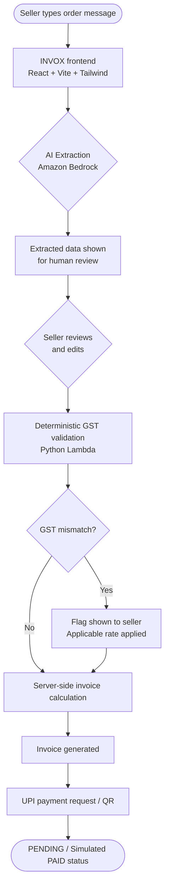
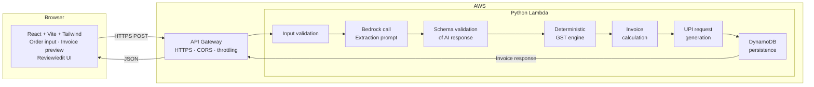
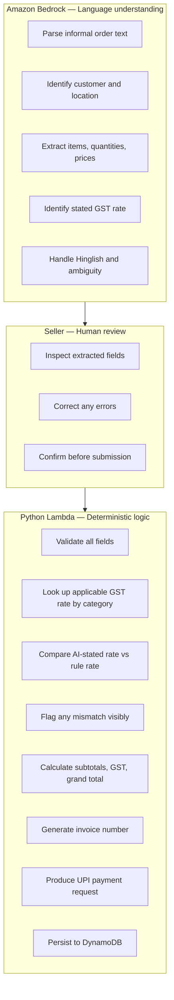
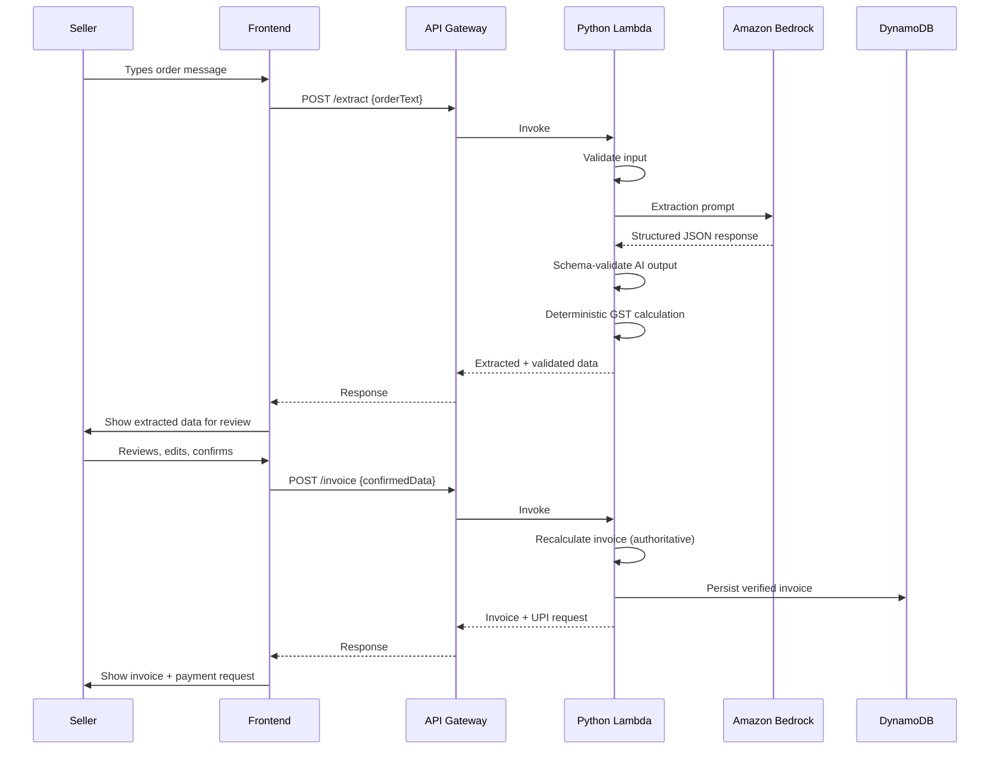

# INVOX

**AI-assisted invoicing from messy business messages.**

> **AI proposes. Rules decide. You stay in control.**

INVOX converts unstructured English/Hinglish business order messages into structured, reviewable invoices. A seller types an order the way they would send a WhatsApp message. INVOX passes it through Amazon Bedrock for natural-language extraction, presents the result for human review and editing, applies a deterministic GST engine for authoritative financial calculation, generates the invoice, and produces a UPI payment request.

The AI never owns the numbers. Every financial result is calculated by deterministic backend logic after the seller has reviewed and confirmed what the AI extracted.

---

## The Problem

Small business invoicing in India is messy. Sellers communicate orders in informal English and Hinglish, mixing item names, quantities, prices, and GST references in any order. Turning that into a compliant invoice requires either manual data entry or expensive ERP software — neither works well for a seller typing on a phone.

---

## The Solution

INVOX treats the order message as the input, not a form. The seller describes the order naturally. Bedrock interprets it. The seller reviews the extracted data, corrects anything the AI got wrong, and the backend handles the rest: GST validation, invoice calculation, and payment request generation.

---

## Core Workflow



---

## Key Principles

| Principle | Description |
|-----------|-------------|
| AI proposes, rules decide | Bedrock extracts. A deterministic engine calculates. |
| Human in the loop | The seller reviews and approves before any invoice is issued. |
| Server-side authority | Financial totals are calculated on the backend, never trusted from the client or AI. |
| GST transparency | Mismatches between AI-stated and rule-validated GST are flagged visibly. |
| Demo reliability | A fixture/mock mode keeps the app demoable if external AI infrastructure is unavailable. |
| Minimal scope | No payment gateway, no auth, no CRM. One workflow, done well. |

---

## Architecture



> **Note:** The AWS backend (Lambda, API Gateway, Bedrock, DynamoDB) is planned and architecturally locked. The frontend foundation is implemented. Backend milestones are in progress.

---

## AI vs Deterministic Rules



The AI handles language. The seller handles judgment. The rules handle arithmetic. No stage can override another without going through the intended flow.

---

## Features

### Implemented (Milestone 1)

- React + Vite + Tailwind CSS frontend foundation
- Two-panel layout: order input on the left, invoice preview on the right
- Order text input with example prompts
- Invoice preview component: line items, per-item GST display, subtotal, GST total, grand total
- Empty state and loading state in the UI
- Mock invoice generation wired end-to-end (Bedrock replaced by a stub; real integration in Milestone 3)
- `Edit Items` and `Send UPI Request` buttons present in UI (disabled; wired in later milestones)
- Kiro engineering configuration: steering files, hooks, evidence system, `AGENTS.md`
- Git history with one commit per milestone

### Planned MVP

- WhatsApp-style order input with message-history feel (Milestone 2)
- Amazon Bedrock extraction with structured prompt and schema validation (Milestone 3)
- Human review and edit experience for extracted data (Milestone 4)
- Deterministic GST engine with intra-state/inter-state handling and mismatch flagging (Milestone 5)
- Invoice generation (Milestone 6)
- UPI payment request / QR code (Milestone 7)
- DynamoDB persistence for verified invoices (Milestone 8)
- Pytest backend test coverage, security hardening (Milestone 9)
- Production deployment via Antideploy (Milestone 10)

---

## Current Implementation Status

| Area | Status |
|------|--------|
| React + Vite frontend foundation | Implemented |
| Tailwind CSS UI foundation | Implemented |
| Order input component | Implemented (mock data) |
| Invoice preview component | Implemented (mock data) |
| Loading and empty states | Implemented |
| Kiro steering and evidence system | Implemented |
| AWS SAM / Lambda backend | Planned |
| API Gateway | Planned |
| Amazon Bedrock integration | Planned |
| Deterministic GST engine | Planned |
| Human review/edit flow | Planned |
| DynamoDB persistence | Planned |
| UPI payment request | Planned |
| Pytest backend tests | Planned |
| Production deployment | Planned |

---

## Technology Stack

| Layer | Technology |
|-------|-----------|
| Frontend | React 18, Vite 5, Tailwind CSS 3 |
| Backend | Python, AWS Lambda |
| API | Amazon API Gateway |
| AI / NLP | Amazon Bedrock |
| Database | Amazon DynamoDB |
| Infrastructure | AWS SAM |
| Testing | Pytest (backend), frontend testing (planned) |
| IDE | Kiro |
| AWS assistance | Amazon Q |
| Deployment | Antideploy |
| Version control | Git + GitHub |

---

## Project Structure

### Current repository

```
invox/
├── src/
│   ├── App.jsx                   # Root layout (two-panel)
│   ├── main.jsx                  # React entry point
│   ├── index.css                 # Tailwind base styles
│   └── components/
│       ├── Header.jsx            # Top navigation
│       ├── ChatInput.jsx         # Order text input + mock invoice
│       ├── InvoicePreview.jsx    # Invoice display + GST calc
│       └── EmptyState.jsx        # Pre-invoice placeholder
├── .kiro/
│   ├── steering/                 # Kiro persistent project rules
│   │   ├── project.md
│   │   ├── architecture.md
│   │   ├── workflow.md
│   │   ├── security.md
│   │   ├── ui-ux.md
│   │   ├── gst-financial.md
│   │   └── hackathon.md
│   └── hooks/
│       ├── secret-detection.json
│       └── milestone-complete-reminder.json
├── docs/
│   └── kiro-evidence/
│       ├── build-journal.md
│       ├── milestone-commits.md
│       └── kiro-contribution-summary.md
├── AGENTS.md                     # Top-level context for Kiro sessions
├── index.html
├── package.json
├── vite.config.js
├── tailwind.config.js
├── postcss.config.js
└── .gitignore
```

### Target MVP structure (planned — introduced as milestones are implemented)

```
invox/
├── src/                          # Frontend (as above, expanded)
├── backend/
│   ├── functions/
│   │   ├── extract/              # Bedrock extraction Lambda
│   │   ├── invoice/              # Invoice calculation Lambda
│   │   └── payment/              # UPI request Lambda
│   ├── layers/
│   │   └── gst_engine/           # Shared deterministic GST logic
│   └── tests/                    # Pytest test suite
├── template.yaml                 # AWS SAM template
└── ...
```

---

## Example: Planned MVP Flow

**Input (what a seller types):**

```
bhaiya 50 mouse 450 wala, Acme Pune ko, 5% gst laga dena
```

**Planned AI extraction result (via Bedrock):**

| Field | Extracted value |
|-------|----------------|
| Customer | Acme |
| Location | Pune, Maharashtra |
| Product | Mouse |
| Quantity | 50 |
| Unit price | ₹450 |
| Stated GST | 5% |

**Planned deterministic validation:**

The stated GST rate (5%) is compared against the applicable rate for the item category. If the configured rule returns 18% for computer peripherals, the system flags the mismatch visibly and applies 18% for the authoritative calculation. The seller sees the discrepancy before the invoice is generated.

**Authoritative calculation (server-side):**

| Line | Subtotal | GST (18%) | Total |
|------|----------|-----------|-------|
| Mouse × 50 @ ₹450 | ₹22,500 | ₹4,050 | ₹26,550 |

> This example describes the **planned MVP flow**. The current implementation shows a mock invoice with hardcoded sample data. Real Bedrock extraction and GST validation are implemented in Milestones 3 and 5.

---

## Data Flow (Planned)



---

## Security and Financial Safety

These are the intended controls for the MVP. Items marked _(planned)_ are not yet implemented.

| Control | Status |
|---------|--------|
| AI output treated as untrusted / schema-validated | Planned |
| Server-side authoritative invoice calculation | Planned |
| Deterministic GST engine (AI cannot override) | Planned |
| GST mismatches flagged visibly to seller | Planned |
| Input validation on all API payloads | Planned |
| Secrets never committed to repository | Active |
| `.env` and AWS credentials in `.gitignore` | Active |
| Least-privilege IAM for Lambda | Planned |
| API request-size limits and throttling | Planned |
| CORS configured for production domain | Planned |
| No sensitive internals exposed to users | Planned |
| Simulated payment status explicitly labeled | Planned |
| No direct browser access to Bedrock or DynamoDB | Architectural |

---

## Testing Strategy (Planned)

Backend testing via Pytest, prioritized by business risk:

1. GST engine — intra-state, inter-state, mismatch detection, rounding, edge cases
2. Invoice total calculation — multi-line, zero values, invalid inputs
3. Bedrock output schema validation — malformed/ambiguous responses
4. API input validation — negative quantities, malformed prices, missing fields
5. UPI request generation
6. DynamoDB persistence

Frontend testing covers key user workflows (Milestone 9).

---

## Development Workflow

Each milestone follows this lifecycle:

1. **Understand** — inspect relevant files, identify risks and dependencies
2. **Plan** — create a concise plan; use a Kiro spec for substantial features
3. **Implement** — smallest correct solution; preserve working code
4. **Verify** — run build/tests, check behavior
5. **Review** — inspect `git diff` and `git status`, check for secrets
6. **Commit** — one logical commit per milestone, conventional commit format
7. **Push** — after Nidhi's approval only
8. **Stop** — wait for next milestone instruction

No automatic commits, pushes, or deployments. Every Git action requires explicit approval.

### Milestone history

| Milestone | Commit | Description |
|-----------|--------|-------------|
| 1 | `818a505` | React + Vite + Tailwind scaffold + initial UI |
| Config | `5ecde8c` | Kiro steering, hooks, evidence system, AGENTS.md |

---

## Kiro, Amazon Q, and Antideploy

This project is built for the **CloudBuild AI Virtual Build-a-Thon**.

| Tool | Role |
|------|------|
| **Kiro** | Primary and exclusive coding IDE. Used for planning, spec creation, implementation, review, and verification across all milestones. |
| **Amazon Q** | AWS-focused assistance: Lambda architecture, Bedrock prompt design, IAM policies, DynamoDB schema. |
| **Antideploy** | Required deployment platform. Production frontend is deployed via Antideploy. |

Kiro steering files (`.kiro/steering/`) are loaded into every session and enforce architecture, security, workflow, and UI/UX standards persistently without needing to re-explain them per session.

---

## Hackathon Context

**Event:** CloudBuild AI Virtual Build-a-Thon  
**Developer:** Nidhi Bhat  
**GitHub:** [the-nidhi-bhat/Invox](https://github.com/the-nidhi-bhat/Invox)

The project is built milestone by milestone with a genuine Git commit per milestone, using Kiro as the exclusive coding environment. Evidence of Kiro usage is maintained in `docs/kiro-evidence/`.

---

## Getting Started

### Prerequisites

- Node.js 18+
- npm 9+

### Frontend development

```bash
git clone https://github.com/the-nidhi-bhat/Invox.git
cd Invox
npm install
npm run dev
```

Local dev server: [http://localhost:5173](http://localhost:5173)

```bash
# Production build
npm run build

# Preview production build locally
npm run preview
```

### Backend / AWS setup

The Python Lambda backend uses AWS SAM and is introduced in later milestones. Backend setup instructions will be added as those milestones are implemented.

### Environment variables

No environment variables are required to run the current frontend in development mode.

Future backend environment variables (planned):

| Variable | Purpose |
|----------|---------|
| `BEDROCK_REGION` | AWS region for Bedrock |
| `BEDROCK_MODEL_ID` | Model identifier for extraction |
| `DYNAMODB_TABLE` | DynamoDB table name |
| `API_CORS_ORIGIN` | Allowed frontend origin |

Never commit `.env` files. Never hardcode secrets.

---

## Future Scope

The following are explicitly outside the current MVP scope and will not be added without a deliberate decision:

- Real WhatsApp / Twilio integration
- Live payment gateway (Razorpay, etc.)
- Real payment verification
- Voice or OCR input
- Multi-tenant authentication
- CRM or inventory management
- GSTN filing or e-invoice IRN
- Analytics dashboard
- RAG or multi-agent systems

The goal is a focused, reliable, well-engineered MVP — not maximum feature count.

---

## Project Status

**Active development — Milestone 1 complete.**

The frontend foundation is implemented and running. Backend milestones are in progress following the milestone plan above.

---

## License

This project is developed for the CloudBuild AI Virtual Build-a-Thon. License to be determined after the event.

---

## Author

**Nidhi Bhat**  
GitHub: [@the-nidhi-bhat](https://github.com/the-nidhi-bhat)  
Email: the.nidhi.bhat@gmail.com
